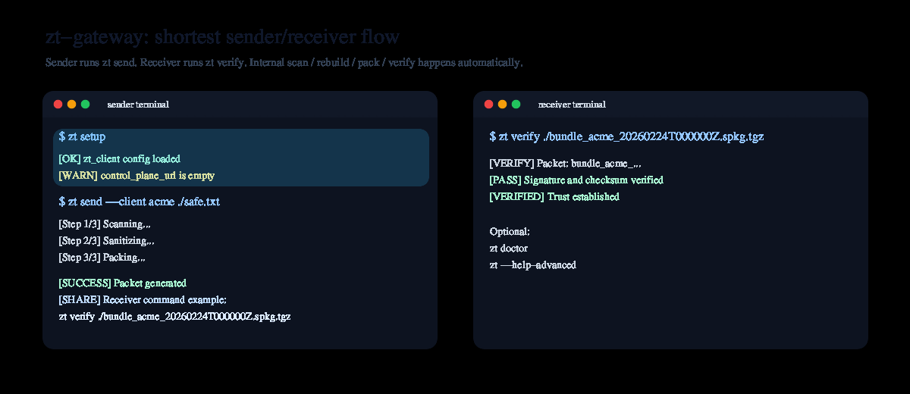
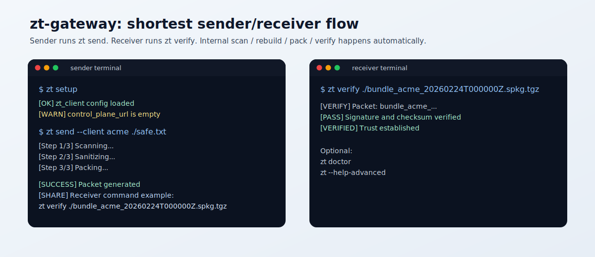
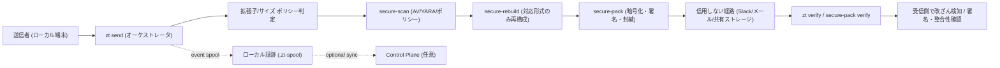

# Zero-Trust Local Gateway (Monorepo, pre-release)
## zt-gateway / secure-pack / secure-scan / secure-rebuild

複雑な運用なしで、Zero Trust 前提の安全なファイル受け渡しを作るためのローカルファーストツール群です。

固定トーク（導入説明の最短版）:

- 送信側は約3分で導入して `zt send` まで到達できます
- 受信側は約1分で `zt verify` だけ実行すれば検証できます

売りたい価値（短く言うと）:

- お互いにソフトを入れるだけで、検査・封緘・検証つきのファイル受け渡しができる
- ネットワークを信用しなくても、署名と検証で受け渡しの証明を持てる
- SaaS依存なしでも運用できる（ローカル実行 + 後で監査同期）

ライセンス方針（現時点）: Apache-2.0 をベースに公開しつつ、将来の商用契約オプションを用意する方針です（`LICENSING.md`）。

## 3分で試す（Quick Start）

まずは送信側・受信側の両方で `zt` CLI を使える状態にしてください（同じリポジトリでもOK）。

### 送信側（コピペ最短）

1. `ROOT_PUBKEY.asc` fingerprint pin を設定（必須 / fail-closed）

`zt setup` / `zt send` は `ROOT_PUBKEY.asc` の fingerprint pin が未設定だと失敗します。
まず `ROOT_PUBKEY.asc` の fingerprint を別経路で確認し、環境変数に固定してください。

```bash
# 例: repo内の ROOT_PUBKEY.asc から fingerprint を取得（表示値は別経路で照合）
ROOT_FPR="$(gpg --show-keys --with-colons ./tools/secure-pack/ROOT_PUBKEY.asc | awk -F: '/^fpr:/ {print $10; exit}')"

# zt（setup / send precheck）で使う pin
export ZT_SECURE_PACK_ROOT_PUBKEY_FINGERPRINTS="${ROOT_FPR}"

# 参考: secure-pack 単体実行ではこちらでも可（複数許容・ローテーション用）
export SECURE_PACK_ROOT_PUBKEY_FINGERPRINTS="${ROOT_FPR}"
```

複数 fingerprint を許容する例（鍵ローテーション時）:

```bash
export ZT_SECURE_PACK_ROOT_PUBKEY_FINGERPRINTS="OLD_FPR_40HEX,NEW_FPR_40HEX"
```

2. セットアップ確認

```bash
go run ./gateway/zt setup
go run ./gateway/zt setup --json   # サポート/自動化向け
# trust profile を切り替える場合
go run ./gateway/zt setup --profile confidential --json
```

運用向け: 鍵ローテーション手順は `docs/SECURE_PACK_KEY_ROTATION_RUNBOOK.md` を参照（旧+新 pin 併記期間 / 切替日 / 削除日 / rollback を明文化）。

3. 送信（標準フロー）

```bash
go run ./gateway/zt send --client <recipient-name> --copy-command ./safe.txt
# trust profile を切り替える場合
go run ./gateway/zt send --client <recipient-name> --profile regulated --copy-command ./safe.txt
```

注: `zt send` は `--client <recipient-name>` 必須になり、legacy `artifact.zp` 経路は削除されました。

4. 新 secure-pack 経路（spkg.tgz を使う場合）

```bash
go run ./gateway/zt send --client <recipient-name> --copy-command --share-format auto ./safe.txt
```

### 受信側（コピペ最短）

送信側の `[SHARE TEXT]` / `[SHARE]` に表示されたコマンドをそのまま実行:

```bash
zt verify ./bundle_xxx.spkg.tgz
```

最短デモ（送信側 / 受信側）:



静止画像版（資料向け）:



困ったとき:

```bash
go run ./gateway/zt doctor
go run ./gateway/zt config doctor --json
go run ./gateway/zt setup --json
go run ./gateway/zt --help-advanced
```

- secure-pack のローカル smoke 手順: `docs/SECURE_PACK_SMOKETEST.md`
- `tools.lock` pin mismatch（macOS/Homebrew 差分）運用方針: `docs/SECURE_PACK_LOCAL_EXECUTION_POLICY.md`
- Ubuntu runner 相当での固定実行: `scripts/dev/run-secure-pack-smoketest-ubuntu-docker.sh`
- CLI I/O・表示契約（v0.4 固定）: `docs/contracts/CLI_IO_DISPLAY_CONTRACT_v0.4.md`

## CI / Slack 連携: `zt send --share-json` の固定スキーマ (v0.3.x)

`zt send` の `--share-json` は、受信側に渡す検証コマンド共有用の payload を **JSON 1オブジェクト** で出力します。

- 対象 route: `stdout`, `file:<path>`（`clipboard`, `command-file:<path>` はコマンド文字列のみ）
- 推奨: CI/Slack 連携では `--share-route none --share-route file:<path> --share-json` を使う
- 理由: `zt send` 本体の進行ログは通常どおり stdout に出るため、`stdout` を丸ごとJSONとして扱わないため

推奨例（CIで JSON をファイル経由で受ける）:

```bash
go run ./gateway/zt send \
  --client <recipient-name> \
  --share-route none \
  --share-route file:/tmp/zt-share.json \
  --share-json \
  ./safe.txt
```

Slack 投稿例（shared text をそのまま使う）:

```bash
jq -r '.text' /tmp/zt-share.json
```

Slack 投稿例（コマンドだけ使う）:

```bash
jq -r '.command' /tmp/zt-share.json
```

### 固定スキーマ（現在の契約）

`--share-json` の payload は次のフィールドを持ちます。

- `kind` (string): 現在は固定値 `receiver_verify_hint`
- `format` (string): `ja` または `en`（`--share-format auto` 指定時も解決後の値）
- `command` (string): 受信側で実行する `zt verify ...` コマンド
- `text` (string): 人間向け共有文（ローカライズ済み、末尾改行を含む）

JSON 例（英語）:

```json
{
  "kind": "receiver_verify_hint",
  "format": "en",
  "command": "zt verify -- './bundle_clientA_20260224T120000Z.spkg.tgz'",
  "text": "Please run the following command on the receiver side to verify the file.\nzt verify -- './bundle_clientA_20260224T120000Z.spkg.tgz'\n"
}
```

JSON 例（日本語）:

```json
{
  "kind": "receiver_verify_hint",
  "format": "ja",
  "command": "zt verify -- './bundle_xxx.spkg.tgz'",
  "text": "受信側で次のコマンドを実行して検証してください。\nzt verify -- './bundle_xxx.spkg.tgz'\n"
}
```

### 互換性ルール（CI/Slack 実装向け）

- `v0.3.x` では上記4フィールドを維持します
- 将来の拡張では **フィールド追加を優先** し、既存フィールドの意味変更は避けます
- 連携側は未知フィールドを無視し、`kind` を見て分岐してください
- 機械処理は `command` を優先し、人間向け表示は `text` を使ってください
- `text` はローカライズされるため、文字列一致での判定には使わないでください

## 対象ユーザー（誰向けのツールか）

想定ユーザー（Primary）:

- 小〜中規模の開発チーム / 情シス: Slack/メール等の「信用しない経路」でファイル受け渡しをしたい
- セキュリティ担当 / 監査対応担当: 「送った/検証した」証跡をローカル起点で残したい
- OSS / 受託開発チーム: SaaS必須にせず、まずローカル運用から始めたい
- CI/CD 担当: `zt setup --json` / `zt config doctor --json` / `zt send --share-json` で自動化したい

現時点でまだ非推奨（Not yet）:

- 全社標準の機密ファイル転送基盤として即導入（pre-release / 統合途中）
- 全ファイル形式の CDR を前提にした運用
- 厳格な鍵ライフサイクル管理や HSM 連携が必須の環境

導入の現実的な入り口:

- まずは `SCAN_ONLY` 対象（`.txt` / `.csv` / `.json` / `.pdf` など）で小さく開始
- 受信側は `zt verify` を運用手順に固定
- 監査/連携は `--share-json` と event spool から段階導入

## なぜ安全なのか（現時点の設計意図） / どこまで安全か

先に結論:

- このツールは「ネットワークを信用しない」前提で、**ローカル検査 + 再構成 + 封緘 + 検証** を積み上げて安全性を上げる設計です
- 一方で、**pre-release かつ統合途中**のため、README の [現状の安全境界](#現状の安全境界-重要) と [THREAT_MODEL.md](./THREAT_MODEL.md) / [SECURITY.md](./SECURITY.md) を前提に使ってください
- 特に強い保証が必要な運用では、`zt send --client <name>` による `*.spkg.tgz` + `zt verify` を推奨します（legacy PoC 経路は暫定）

### 安全の考え方（図）



### セキュリティリスクを潰している点（現状）

- デフォルト拒否の拡張子ポリシー: 未知拡張子や危険な圧縮/実行形式は `DENY`（`gateway/zt/ext_policy.go`）
- サイズ上限のポリシー適用: 過大ファイルを入口で拒否可能（`gateway/zt/ext_policy.go`）
- `SCAN_REBUILD` と `SCAN_ONLY` の分離: 対応形式だけ再構成、その他はポリシーで明示（`gateway/zt/ext_policy.go`）
- `zt send` / `zt scan` 入口で拡張子と MIME/magic bytes の基本整合チェックを行い、偽装（例: `*.txt` に EXE / `*.pdf` に ZIP）を block
- `secure-scan` JSON モードで findings/errors を `deny` 扱い（`tools/secure-scan/cmd/secure-scan/json_scan.go`）
- `extension_policy.toml` / `scan_policy.toml` の parse/load エラー時は `zt send` を fail-closed（設定破損で安全性が静かに低下しない）
- `secure-pack send` は `tools.lock` / `tools.lock.sig` / `ROOT_PUBKEY.asc` を必須にし、送信前に root key fingerprint pin + `tools.lock` 署名検証 + `gpg`/`tar` hash/version pin 照合を実施（供給網の改ざん検知）
- `secure-pack verify` 経路では署名検証 + SHA256 照合を実施（`tools/secure-pack/internal/pack/unpack.go`）
- イベントはローカル spool に退避でき、Control Plane 未設定でも送信処理を止めない（運用継続性）（`gateway/zt/events.go`）
- イベント署名（任意）: Ed25519 で envelope 署名可能（`gateway/zt/events_emit.go`）
- `zt setup` / `zt config doctor` による事前診断（鍵ENV、spool書込、CP URL、ツール有無、ClamAV DB など）

### 現在の穴・未完了の点（重要）

以下は「既知ギャップ」です。運用で回避しつつ、今後潰す前提です。

- legacy `artifact.zp` send/verify 経路は削除済み。運用/ドキュメント/自動化が `*.spkg.tgz` 前提に揃っているかの確認は引き続き必要（`gateway/zt/commands_flow.go`, `gateway/zt/commands_verify.go`）
- `secure-scan` 自体は strict 未指定かつ scanner 不在時に `allow`（degraded）になり得るため、`zt send` では strict を安全デフォルトにしている（`tools/secure-scan/cmd/secure-scan/json_scan.go`, `gateway/zt/commands_flow.go`）
- `zt` 側は厳格な `scan_policy` を前提にしているが、運用で `required_scanners` / `require_clamav_db` を弱めると degraded 許容が起こり得る（`gateway/zt/scan_policy.go`, `tools/secure-scan/cmd/secure-scan/json_scan.go`）
- MIME/magic bytes 整合チェックは基本実装済みだが、対応形式はまだ限定的（主に text/PDF/JPEG/PNG/GIF/WebP/OOXML/一部アーカイブ署名）。Windows 日本語環境向けに Shift-JIS 系の text 判定も保守的に許容。深い形式検証や MIME 判定網羅は今後の強化項目（`gateway/zt/file_type_guard.go`, [THREAT_MODEL.md](./THREAT_MODEL.md)）
- `ROOT_PUBKEY.asc` の fingerprint pin は env / 配布ビルドの固定値前提。pin 配布（端末/CI）を標準手順にしないと、fail-closed で `zt setup` / `zt send` / `secure-pack send` が止まる（意図どおり）

### 現時点での安全な運用ガイド（推奨）

- 送受信は `*.spkg.tgz` を標準手順に固定する（legacy `artifact.zp` は廃止）
- `zt send --client <name>` を標準手順にする（legacy フォールバックを踏まない）
- trust posture は `--profile public|internal|confidential|regulated` で固定し、業務区分ごとに使い分ける
- `zt send` の strict デフォルトを維持し、`--allow-degraded-scan` はローカル検証用途に限定
- `policy/scan_policy.toml` で `required_scanners` / `require_clamav_db=true` を維持（弱める変更はレビュー対象にする）
- `ZT_SECURE_PACK_ROOT_PUBKEY_FINGERPRINTS` を端末プロファイル/CI に固定し、鍵ローテーション時は旧+新の複数 fingerprint を一時的に併記する
- `zt setup --json` / `zt config doctor --json` を CI に入れて設定劣化を検知（fixtureゲート: `scripts/ci/check-zt-setup-json-gate.sh`）
- 実artifactをリポジトリに置く運用では、actual repo ゲート `scripts/ci/check-zt-setup-json-actual-gate.sh` も有効化し、`ZT_SECURE_PACK_ROOT_PUBKEY_FINGERPRINTS` を GitHub Actions Variables（推奨）または Secrets に配布する
- 監査/通知は `--share-json` と event spool を使い、運用手順を人依存にしすぎない

補足:

- `zt setup --json` は補助フィールド `resolved.profile` / `resolved.actual_root_fingerprint` / `resolved.pin_source` / `resolved.pin_match_count` と `compatibility`（原因カテゴリ・環境情報・修復候補）を出力します（CI・問い合わせ切り分け向け）
- `zt send` precheck 失敗時は `ZT_ERROR_CODE=ZT_PRECHECK_SUPPLY_CHAIN_FAILED`、`secure-pack send` は `SECURE_PACK_ERROR_CODE=...` を出力します
- 運用一次対応の共通参照（CI/Helpdesk/runbook）は `docs/OPERATIONS.md` を正本として使用

### 運用・CIの共通参照（短縮版）

詳細は `docs/OPERATIONS.md` を参照してください（正本）。

- 代表エラーコード一覧（`zt` / `secure-pack`）
- `zt setup --json` の確認ポイント（`checks[]`, `resolved.pin_*`）
- CI ゲート（fixture / actual repo）の使い分け
- GitHub Actions Variable 配布（`gh variable set` / `gh api` / `curl`）
- 実artifact配置 -> actual repo ゲート通過の手順

## 何を自動でやるのか（利用者に見せたい体験）

`zt send` は、内部で次を順番に実行します。

1. `secure-scan` で検査（ポリシー・AV/YARA等）
2. `secure-rebuild` で再構成/無害化（必要な拡張子のみ）
3. `secure-pack` で暗号化・署名・封緘
4. イベントはローカルに spooling（必要なら Control Plane へ同期）

利用者は「送る」「検証する」に集中できます。

## Status

このリポジトリは **OSS公開準備中のモノレポ移行段階** です。

- `tools/secure-pack`, `tools/secure-scan`: 単体リポジトリ版を取り込み中（本命）
- `tools/secure-rebuild`: `zt-gateway` 側PoCを継続開発
- `tools/poc/*`: 退避した旧PoC実装（比較/参照用）

現時点では **本番の機密データ運用を推奨しません**。先に `SECURITY.md` と `THREAT_MODEL.md` を確認してください。

## 現状の安全境界 (重要)

このリポジトリには段階的に置き換え中の実装が混在しています。特に以下は未完成または統合途中です。

- `zt-gateway` と新しい `secure-pack` / `secure-scan` のCLI仕様は一部に互換アダプタを含む
- `secure-rebuild` は一部形式のみ再構成対応
- 拡張子ごとの「scan-only / rebuild必須 / deny」のポリシーは整備中
- 署名/検証フローの一部はPoC設計から再設計中

README の Quick Start は「導入と流れの理解」を目的にしたものです。実運用前に `SECURITY.md` / `THREAT_MODEL.md` を確認してください。

## 思想（設計の前提）

このシステムは、以下の「3つの信頼」と「3つの不信」の上に成り立っています。

### 信用するもの

1. ローカル: 自分の手元で動く処理
2. 鍵: 暗号学的な署名と検証
3. 再現可能性: Nixによる環境固定

### 信用しないもの

1. ネットワーク: 外部通信は盗聴・改ざんの対象
2. UI: 人間の操作はミスを誘発する
3. SaaS: 外部サービスは停止・侵害を前提に考える

## 対応拡張子ポリシー (v0.1.0 目標の初期方針)

以下は「現在の設計方針」です。実装状況とは分けて管理します。

| 拡張子 | 初期ポリシー | 再構成 (CDR) | 備考 |
| --- | --- | --- | --- |
| `.txt` `.md` `.csv` `.json` | `SCAN_ONLY` | なし | まず対象化しやすい |
| `.jpg` `.jpeg` `.png` | `SCAN_REBUILD` | あり (PoCあり) | 再エンコードでメタデータ除去 |
| `.pdf` | `SCAN_ONLY` から開始 | 後で追加 | `REBUILD` は後段実装 |
| `.docx` `.xlsx` `.pptx` | `SCAN_ONLY` から開始 | 後で追加 | 埋め込み/マクロ対策を別途設計 |
| `.zip` など圧縮 | `DENY` (初期) | なし | 再帰展開/zip bomb対策が必要 |
| 未知拡張子 | `DENY` | なし | fail closed |

注意:

- 拡張子だけでなく、将来的に MIME / magic bytes でも判定する前提です
- 例外許可はポリシーで明示し、デフォルト拒否を維持します

## 開発の始め方

### Go workspace (monorepo)

このリポジトリは `go.work` を使って複数モジュールを同時開発します。

対象モジュール:

- `gateway/zt`
- `tools/secure-pack`
- `tools/secure-scan`
- `tools/secure-rebuild`

### 既存のNixエントリポイント（互換レイヤ）

現在の `nix run .#zt` フローは旧PoC設計を前提にしている箇所があります。モノレポ統合に伴い更新予定です。

### Colima (Docker Desktop を使わない前提)

Control Plane の Postgres 検証は、Docker Desktop ではなく **Colima 前提** を推奨します。

最小オンボーディング:

```bash
brew install colima docker docker-compose
colima start --cpu 4 --memory 8 --disk 60
docker ps
```

停止:

```bash
colima stop
```

補足:

- `docker compose` プラグインが無い環境では `docker-compose` を使ってください
- Postgres dual-write の検証手順は `docs/CONTROL_PLANE_POSTGRES_SMOKETEST.md` を参照
- `zt` のイベント送信運用は `--no-auto-sync`（ローカル spool のみ）と `--sync-now`（コマンド終了時に強制同期）を使い分けできます
- `zt` のイベント自動同期デフォルトは `policy/zt_client.toml` の `auto_sync` で設定できます（優先順位: `CLI --no-auto-sync` > `ENV (ZT_NO_AUTO_SYNC / ZT_EVENT_AUTO_SYNC)` > `zt_client.toml` > built-in）
- `zt_client.toml` には `control_plane_url` / `api_key` も置けます（優先順位: `ENV (ZT_CONTROL_PLANE_URL / ZT_CONTROL_PLANE_API_KEY)` > `zt_client.toml` > built-in）
- `ZT_EVENT_SIGNING_KEY_ID` が未設定でも envelope 署名は可能ですが、これは legacy 単一検証鍵モード向けです（Control Plane の event key registry 有効時は `envelope.key_id_required` で拒否されます）
- `zt sync --json` は `error_class` / `error_code` を固定出力します（`envelope.*` 4xx は `fail_closed`、5xx/通信失敗は `retryable`）
- Control Plane が `envelope.*` の 4xx を返した場合、`zt sync` / `--sync-now` は fail-closed で失敗し、設定修正後に `zt sync --force` で再送します
- `.zt-spool/pending.jsonl` には `first_failed_at` / `last_failed_at` / `error_class` が保持され、`fail_closed` は `--force` 以外の自動再試行を抑制します
- Control Plane ingest は `event_id + payload_sha256` を冪等キーとして扱い、重複時は `duplicate=true` を返します
- 設定確認は `zt config doctor` で実行できます（設定解決元、spool 書き込み可否、署名鍵ENVの妥当性など）
- CI 用には `zt config doctor --json` を使うと純JSONで判定結果を取得できます
- `zt config doctor --json` は `version` と `exit_code` を含むので、CI 側で安定して判定できます
- `zt config doctor --json` は `schema_version` も含むので、CI 側でJSON互換判定を固定化できます
- `zt setup --json` も `schema_version` を含み、**破壊的変更時のみ** version を上げます（追加フィールドでは据え置き）
- `zt setup --json` の互換性ルールは `docs/SETUP_JSON_SCHEMA_POLICY.md` を参照
- `zt config doctor --json` は `generated_at` (UTC RFC3339) を含むので、CIログの時刻突合にも使えます
- `zt config doctor --json` は `command` / `argv` も含むので、CI実行時のトレースがしやすくなります

## ディレクトリ構成 (現在)

```text
.
├── flake.nix
├── gateway/
│   └── zt/                 # Gateway CLI (orchestrator)
├── tools/
│   ├── secure-pack/        # 本命実装（単体リポ取り込み）
│   ├── secure-scan/        # 本命実装（単体リポ取り込み）
│   ├── secure-rebuild/     # CDR/再構成 (PoC)
│   └── poc/                # 退避した旧PoC (比較用)
├── policy/
├── THREAT_MODEL.md
├── SECURITY.md
└── LICENSE
```

## v0.1.0 に向けた優先タスク

1. `zt-gateway` と `secure-pack` / `secure-scan` のCLI統合
2. 安全デフォルトの徹底（固定鍵禁止、fail closed）
3. `verify` の真正な署名検証実装
4. 拡張子ポリシー表と実装の整合
5. テスト/ドキュメント整備後に初回公開
