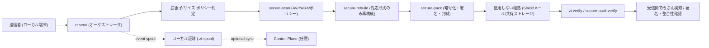

# Zero-Trust Local Gateway (Monorepo, pre-release)
## zt-gateway / secure-pack / secure-scan / secure-rebuild

複雑な運用なしで、Zero Trust 前提の安全なファイル受け渡しを作るためのローカルファーストツール群です。

固定トーク（導入説明の最短版）:

- 送信側は約3分で導入して `zt send` まで到達できます
- 受信側は約1分で `zt verify` だけ実行すれば検証できます

売りたい価値（短く言うと）:

- お互いにソフトを入れるだけで、検査・封緘・検証つきのファイル受け渡しができる
- ネットワークを信用しなくても、署名と検証で受け渡しの証明を持てる
- SaaS依存なしでも運用できる（ローカル実行 + 後で監査同期）

ライセンス方針（現時点）: Apache-2.0 をベースに公開しつつ、将来の商用契約オプションを用意する方針です（`LICENSING.md`）。

## 3分で試す（Quick Start）

まずは送信側・受信側の両方で `zt` CLI を使える状態にしてください（同じリポジトリでもOK）。

### 送信側（コピペ最短）

1. `ROOT_PUBKEY.asc` fingerprint pin を設定（必須 / fail-closed）

`zt setup` / `zt send` は `ROOT_PUBKEY.asc` の fingerprint pin が未設定だと失敗します。
まず `ROOT_PUBKEY.asc` の fingerprint を別経路で確認し、環境変数に固定してください。

```bash
# 例: repo内の ROOT_PUBKEY.asc から fingerprint を取得（表示値は別経路で照合）
ROOT_FPR="$(gpg --show-keys --with-colons ./tools/secure-pack/ROOT_PUBKEY.asc | awk -F: '/^fpr:/ {print $10; exit}')"

# zt（setup / send precheck）で使う pin
export ZT_SECURE_PACK_ROOT_PUBKEY_FINGERPRINTS="${ROOT_FPR}"

# 参考: secure-pack 単体実行ではこちらでも可（複数許容・ローテーション用）
export SECURE_PACK_ROOT_PUBKEY_FINGERPRINTS="${ROOT_FPR}"
```

CIでの zero-trust 寄り運用（推奨）:

- `ZT_SECURE_PACK_ROOT_PUBKEY_FINGERPRINTS_EXPECTED` を保護変数として配布
- `scripts/ci/check-zt-setup-json-actual-gate.sh` が `ROOT_PUBKEY.asc` の fingerprint 一致を検証後、`ZT_SECURE_PACK_ROOT_PUBKEY_FINGERPRINTS` を自動bootstrap

1コマンド登録（GitHub Variables）:

```bash
# 推奨: 承認済み pin を明示（鍵ローテーション時は old,new）
bash ./scripts/dev/bootstrap-ci-root-pin-expected.sh --expected-pins "OLD_FPR_40HEX,NEW_FPR_40HEX"

# One-trust: ローカル ROOT_PUBKEY.asc をそのまま登録
bash ./scripts/dev/bootstrap-ci-root-pin-expected.sh --trust-local-root-key
```

複数 fingerprint を許容する例（鍵ローテーション時）:

```bash
export ZT_SECURE_PACK_ROOT_PUBKEY_FINGERPRINTS="OLD_FPR_40HEX,NEW_FPR_40HEX"
```

2. セットアップ確認

```bash
go run ./gateway/zt setup
go run ./gateway/zt setup --json   # サポート/自動化向け
# trust profile を切り替える場合
go run ./gateway/zt setup --profile confidential --json
```

運用向け: 鍵ローテーション手順は `docs/SECURE_PACK_KEY_ROTATION_RUNBOOK.md` を参照（旧+新 pin 併記期間 / 切替日 / 削除日 / rollback を明文化）。

3. 送信（標準フロー）

```bash
go run ./gateway/zt send --client <recipient-name> --copy-command ./safe.txt
# trust profile を切り替える場合
go run ./gateway/zt send --client <recipient-name> --profile regulated --copy-command ./safe.txt
```

注: `zt send` は `--client <recipient-name>` 必須になり、legacy `artifact.zp` 経路は削除されました。

4. 新 secure-pack 経路（spkg.tgz を使う場合）

```bash
go run ./gateway/zt send --client <recipient-name> --copy-command --share-format auto ./safe.txt
```

### 受信側（コピペ最短）

送信側の `[SHARE TEXT]` / `[SHARE]` に表示されたコマンドをそのまま実行:

```bash
zt verify ./bundle_xxx.spkg.tgz
```

最短デモ（送信側 / 受信側）:


静止画像版（資料向け）:


困ったとき:

```bash
go run ./gateway/zt doctor
go run ./gateway/zt config doctor --json
go run ./gateway/zt setup --json
go run ./gateway/zt --help-advanced
```

- secure-pack のローカル smoke 手順: `docs/SECURE_PACK_SMOKETEST.md`
- `tools.lock` pin mismatch（macOS/Homebrew 差分）運用方針: `docs/SECURE_PACK_LOCAL_EXECUTION_POLICY.md`
- Ubuntu runner 相当での固定実行: `scripts/dev/run-secure-pack-smoketest-ubuntu-docker.sh`
- CLI I/O・表示契約（v0.4 固定）: `docs/contracts/CLI_IO_DISPLAY_CONTRACT_v0.4.md`

## 追加運用（unlock / dashboard / relay drive）

### 1) trusted signer 固定（必須）

`unlock token` は、`ZT_BREAKGLASS_TRUSTED_SIGNERS` が未設定だと有効化されません。  
運用では **trusted signer を固定してから** `unlock issue/verify` を使ってください。

```bash
# 形式: <signer_id>:<pubkey_b64> をカンマ区切り（; / 改行区切りも可）
export ZT_BREAKGLASS_TRUSTED_SIGNERS="ops1:BASE64_PUBKEY_1,ops2:BASE64_PUBKEY_2"

# 状態確認（active=true を確認）
go run ./gateway/zt unlock verify --json
go run ./gateway/zt setup --json
```

補足:

- token ファイルだけ置いても、trusted signer 未設定なら `active=false`（fail-closed）
- 緊急回避用途として `ZT_BREAKGLASS_ALLOW_EMBEDDED_SIGNERS=1` がありますが、通常運用では非推奨

### 2) dashboard の危険信号 / unlock badge / ローカルロック

`zt dashboard` は、危険信号（danger）とローカルロック状態を表示します。

- `danger.level=high|medium|low` で運用リスクを集約表示
- `danger.signals[]` に原因コードを列挙（例: `tools_lock_signature_unverified`, `receipt_tamper_detected`, `dashboard_alert_dispatch_unsafe_config`）
- `Local Lock` は dashboard から lock/unlock 操作でき、`send` と `relay` を停止できます（fail-closed）
- v0.9.5/0.9.6 で `control_plane` / `kpi` / `incidents` / `alerts` を同一JSONに統合（ローカル+CP統合モデル）
- incident 操作（`lock` / `unlock` / `break_glass_start` / `break_glass_end`）は `.zt-spool/dashboard_incidents.jsonl` に監査記録

ロック状態ファイル（既定）:

- `.zt-spool/local-lock.json`
- 変更したい場合は `ZT_LOCAL_LOCK_FILE` を使用

- `有効` (`active`): trusted signer 固定 + 2承認以上 + 期限内
- `解除申請中` (`pending`): token はあるが有効承認数が不足（例: 1/2）
- `期限切れ` (`expired`): token 期限超過
- `無効` (`inactive`): token ありだが trusted signer 未設定/不整合などで不活性
- `未設定` (`none`): token ファイルなし

ローカル確認:

```bash
go run ./gateway/zt dashboard
# または
go run ./gateway/zt dashboard --json | jq '.danger, .lock, .unlock, .kpi, .alerts, .control_plane'
```

Local dashboard API（LFC-1005: クライアント別資産ビュー）:

- `GET /api/clients` : クライアント一覧（`tenant_id`, `q`, `page`, `page_size`, `sort`, `export=csv`）
- `GET /api/clients/{client_id}` : クライアント単位の資産一覧（`tenant_id`, `q`, `page`, `page_size`, `sort`, `export=csv`）
- `sort`:
  - clients: `created_at_desc|created_at_asc|last_seen_desc|last_seen_asc`
  - assets: `last_seen_desc|last_seen_asc|created_at_desc|created_at_asc`
- tenant 固定運用時（`ZT_DASHBOARD_TENANT_ID` 設定）は fail-closed で検証
  - 未指定: `tenant_scope_required`
  - 不一致: `tenant_scope_violation`

Local dashboard API（LFC-1006: 鍵ライフサイクル可視化）:

- `GET /api/keys` : 鍵一覧（`tenant_id`, `q`, `status`, `page`, `page_size`, `sort`, `export=csv`）
- `GET /api/keys/{key_id}` : 鍵詳細
- `POST /api/keys/{key_id}/status` : 鍵状態遷移（body: `status`, `reason`, `actor`, `evidence_ref`）
  - status: `active|rotating|revoked|compromised`
  - 遷移時は `local_sor_incidents(action=key_status_transition)` に監査記録
- `compromised` 鍵が1件以上ある場合、`danger` は fail-closed で `high` になる

Local dashboard API（LFC-1007: Key Repair MVP）:

- `GET /api/key-repair/jobs` : 修復ジョブ一覧（`tenant_id`, `key_id`, `q`, `state`, `page`, `page_size`, `sort`, `export=csv`）
- `POST /api/key-repair/jobs` : 修復ジョブ起票（body: `key_id`, `trigger`, `operator`, `summary`, `evidence_ref`, `runbook_id`）
- `GET /api/key-repair/jobs/{job_id}` : 修復ジョブ詳細
- `POST /api/key-repair/jobs/{job_id}/transition` : 状態遷移（body: `state`, `operator`, `summary`, `evidence_ref`, `runbook_id`）
  - state: `detected -> contained -> rekeyed -> rewrapped -> completed`（`failed` は各段階から遷移可）
- 鍵が `compromised` になると、`key_repair_detected` を自動起票（runbook付き）
- `key_repair` の open job がある間は `danger` に `key_repair_in_progress`（high）を表示

Local dashboard API（LFC-1008: 利用回数/KPI集計）:

- `GET /api/kpi` : dashboard と同一計算の KPI/SLO を返却
- KPI は `local_sor_exchanges` を一次ソースに集計
  - `exchange_total`, `send_count`, `receive_count`, `verify_receipts_total`, `verify_pass_count`, `verify_fail_count`
- tenant SLO 表示:
  - `tenant_id`
  - `verify_pass_slo_target`（`ZT_DASHBOARD_SLO_VERIFY_PASS_TARGET`, default `0.99`）
  - `verify_pass_slo_met`, `backlog_slo_met`
- backlog は `backlog_threshold_seconds` と `event_sync` の oldest age で判定

Local dashboard API（LFC-1009: 署名保有者数 MVP）:

- `GET /api/signature-holders` : tenant 単位の署名保有者一覧（`tenant_id`, `q`, `page`, `page_size`, `sort`, `export=csv`）
- `GET /api/clients/{client_id}/signature-holders` : client drill-down（同じ query/CSV をサポート）
- `signature_id` は signer fingerprint を使用
- 表示項目:
  - `holder_count_estimated`（distinct client 数）
  - `holder_count_confirmed`（verify pass を返した distinct client 数）
  - `event_count` / `client_event_count`（算出根拠イベント件数）
- receipt 取込時に `local_sor_signature_holders` を自動更新

Local dashboard API（LFC-1010: 外部通知安全ゲート）:

- `POST /api/alerts/dispatch` : 外部通知送信（body: `channel`, `webhook_url`, `dry_run`）
  - `channel`: `slack|discord|line|webhook`（未指定時は `webhook`）
- fail-closed 条件:
  - `ZT_DASHBOARD_ALERT_DISPATCH_ENABLED=1` が未設定なら拒否
  - webhook URL が HTTPS 以外なら拒否
  - `ZT_DASHBOARD_ALERT_WEBHOOK_ALLOW_HOSTS` が空/不一致なら拒否
- 送信 payload は最小化（`level/count` と alert code のみ。詳細メッセージは外部送信しない）
- 送信結果（`rejected|dry_run|failed|sent`）は監査ログ `.zt-spool/events.jsonl` に
  `event_type=dashboard_alert_dispatch` として記録

Control Plane dashboard API（tenant/role authz）:

- `GET /v1/dashboard/activity` : 検索/ページング/CSV export（`q`, `page`, `page_size`, `export=csv`）
- `GET /v1/dashboard/activity/groups` : tenant/kind 集計
- `GET /v1/dashboard/timeseries` : SLO/drift/backlog-proxy の時系列
- `GET /v1/dashboard/drilldown` : event -> receipt -> policy -> runbook
- `POST /v1/admin/scim/sync` : SCIM 同期（admin only, role mapping 反映）
- `GET /v1/admin/scim/sync` : SCIM 同期状態（適用ユーザー数 / 最終同期時刻）

認証/認可ヘッダ:

- `X-API-Key`（`ZT_CP_API_KEY` を設定している場合は必須）
- `Authorization: Bearer <JWT>`（`ZT_CP_SSO_ENABLED=1` の場合）
- `X-ZT-Dashboard-Role` (`viewer|operator|auditor|admin`)
- `X-ZT-Tenant-ID`（auth有効時に非adminは必須）
  - SSO時は tenant はJWT claim（`ZT_CP_SSO_TENANT_CLAIM`）を優先

SSO（OIDC/SAML連携のJWT検証）を有効化する例:

```bash
export ZT_CP_SSO_ENABLED=1
export ZT_CP_SSO_ISSUER="https://issuer.example.com/"
export ZT_CP_SSO_AUDIENCE="zt-control-plane"
export ZT_CP_SSO_ROLE_CLAIM="role"        # default: role
export ZT_CP_SSO_TENANT_CLAIM="tenant_id" # default: tenant_id
export ZT_CP_SSO_ADMIN_ROLES="admin,security-admin"
export ZT_CP_SSO_JWT_HS256_SECRET="<shared-secret>"
# RS256 を使う場合は代わりに:
# export ZT_CP_SSO_JWT_RS256_PUBKEY_PEM="$(cat ./keys/sso_rsa_pub.pem)"
```

Passkey/WebAuthn 二段目認証（LFC-1004）を有効化する例:

```bash
export ZT_CP_WEBAUTHN_ENABLED=1
export ZT_CP_WEBAUTHN_RP_ID="localhost"
export ZT_CP_WEBAUTHN_RP_ORIGIN="http://localhost:3000"
# 管理変更APIにstep-up必須（default: enabled when WEBAuthn enabled）
export ZT_CP_WEBAUTHN_ENFORCE_ADMIN_MUTATIONS=1
```

WebAuthn ceremony API:

- `POST /v1/auth/webauthn/attestation/options`
- `POST /v1/auth/webauthn/attestation/verify`
- `POST /v1/auth/webauthn/assertion/options`
- `POST /v1/auth/webauthn/assertion/verify`（`step_up_token` を払い出し）

管理変更API（event keyの POST/PUT/PATCH/DELETE）は、WebAuthn step-up有効時に
`X-ZT-Step-Up-Token` が無いと fail-closed で拒否されます。

`zt dashboard` から Control Plane へ SSOで接続する場合:

```bash
export ZT_CONTROL_PLANE_BEARER_TOKEN="<JWT>"
go run ./gateway/zt dashboard
```

外部通知（Slack/Discord/LINE/Webhook）は **デフォルト無効**:

- `ZT_DASHBOARD_ALERT_DISPATCH_ENABLED=1` で明示有効化
- `ZT_DASHBOARD_ALERT_WEBHOOK_ALLOW_HOSTS`（許可ホスト列挙）が空なら送信拒否
- HTTPS以外の webhook URL は拒否（fail-closed）

v1.1 運用拡張（LFC-1102/1103/1107）:

- signature holders API は `confirmed_coverage_ratio` / `confirmation_status` を返却
- KPI に `key_repair_auto_recovery_rate`（自動起票ジョブの完了率）を追加
- KPI に `signature_anomaly_false_positive_ratio` を追加
- `ZT_DASHBOARD_ANOMALY_FALSE_POSITIVE_THRESHOLD`（default `0.20`）超過時は
  alerts に `signature_anomaly_false_positive_high` を表示

v1.2 大規模/モバイル統合（LFC-1201〜1207）:

- 管理変更APIの監査メタに mobile MFA コンテキストを記録（`X-ZT-MFA-Platform` / `X-ZT-MFA-Device-ID` / `X-ZT-MFA-Factor` + AMR）
- SSO を multi-issuer 化:
  - `ZT_CP_SSO_TRUSTED_ISSUERS`（CSV）
  - `ZT_CP_SSO_ENTERPRISE_ISSUERS`（CSV）
  - `ZT_CP_SSO_ENTERPRISE_POLICY=allow_all|enterprise_only|enterprise_or_apple`
  - `ZT_CP_SSO_APPLE_ISSUER`（default `https://appleid.apple.com`）
- `/healthz` に HA 計測値を追加（`ha.rpo_*` / `ha.rto_*`）:
  - `ZT_CP_HA_ENABLED`
  - `ZT_CP_HA_RPO_OBJECTIVE_SECONDS`（default `60`）
  - `ZT_CP_HA_RTO_OBJECTIVE_SECONDS`（default `300`）
- signature holders に realtime 推定遅延 SLO を追加:
  - `realtime_estimate_lag_seconds`
  - `realtime_estimate_slo_seconds`
  - `realtime_estimate_slo_met`
  - `ZT_DASHBOARD_SIGNATURE_HOLDER_SLO_SECONDS`（default `120`）
- `zt audit report --template legal-v1 --contract-id <id>` で法務テンプレ付き月次監査レポートを生成
- 改ざん耐性オプション（外部台帳）:
  - `ZT_AUDIT_EXTERNAL_LEDGER_ENABLED=1`
  - `ZT_AUDIT_EXTERNAL_LEDGER_PATH=<path>`（default `.zt-spool/audit-external-ledger.jsonl`）

監査運用（LFC-1104/1106）:

- `zt audit report --month YYYY-MM --json-out <path> --pdf-out <path>` で月次監査レポートを生成
- `zt audit rotate --retention-days <days>` で月次ローテーションと保持期間削除を実行
- `ZT_AUDIT_RETENTION_DAYS`（default `90`）で保持日数を設定

### 3) relay drive の Google Drive API 直upload（任意）

`relay drive` は、ローカル同期フォルダコピーに加えて `--api-upload` で Drive API へ直接 upload できます。

事前準備:

- Google OAuth access token を取得（Drive upload 可能な scope）
- 必要なら格納先フォルダIDを控える（`--drive-folder-id`）

実行例（API upload のみ）:

```bash
export ZT_GOOGLE_DRIVE_ACCESS_TOKEN="<oauth_access_token>"

go run ./gateway/zt relay drive \
  --packet ./bundle_clientA_20260224T120000Z.spkg.tgz \
  --api-upload \
  --drive-folder-id "<google_drive_folder_id>" \
  --write-json
```

実行例（ローカル同期フォルダ + API upload 併用）:

```bash
go run ./gateway/zt relay drive \
  --packet ./bundle_clientA_20260224T120000Z.spkg.tgz \
  --folder "$HOME/Google Drive/My Drive/zt-share" \
  --api-upload \
  --drive-folder-id "<google_drive_folder_id>" \
  --write-json
```

出力される添付物:

- packet 本体 (`*.spkg.tgz`)
- 受信者向け verify 手順 (`*.verify.txt`)
- 共有JSON (`*.share.json`, `--write-json=true` 時)

### 4) relay auto-drive（watchフォルダ自動化）

送信元フォルダを監視し、`zt send` -> `relay drive` を自動実行できます。  
処理済み原本は `watch-dir/.zt-done/`、失敗原本は `watch-dir/.zt-error/` へ移動します。

v1.0.1 追加（運用強化）:

- `--stable-window` で部分書き込み中ファイルの誤処理を抑止
- `--max-retries` + `--retry-backoff` で指数バックオフ再試行
- `--dedup-ledger` で同一内容の重複送信を抑止（idempotency）

```bash
go run ./gateway/zt relay auto-drive \
  --client clientA \
  --watch-dir ./dropbox/send-queue \
  --folder "$HOME/Google Drive/My Drive/zt-share" \
  --poll-interval 5s \
  --stable-window 3s \
  --max-retries 3 \
  --retry-backoff 5s
```

1回だけ処理して終了:

```bash
go run ./gateway/zt relay auto-drive \
  --client clientA \
  --watch-dir ./dropbox/send-queue \
  --folder "$HOME/Google Drive/My Drive/zt-share" \
  --once
```

### 5) relay hook（拡張連携ブリッジ）

OS拡張/ブラウザ拡張/Automator から呼ぶためのブリッジです。

1ファイルをCLI経由でラップ:

```bash
go run ./gateway/zt relay hook wrap \
  --path ./sample.txt \
  --client clientA \
  --share-format auto \
  --json
```

Finder Quick Action向けに複数ファイルを一括ラップ:

```bash
go run ./gateway/zt relay hook finder-quick-action \
  --client clientA \
  --share-format auto \
  --force-public \
  --json \
  ./sample1.txt ./sample2.txt
```

Finder Quick Action をコマンドで自動登録（推奨）:

```bash
go run ./gateway/zt relay hook install-finder \
  --client clientA \
  --share-format auto \
  --force-public \
  --force \
  --json
```

設定だけ更新（Quick Actionを再作成せず、client/bin/pathだけ更新）:

```bash
go run ./gateway/zt relay hook configure-finder \
  --client clientA \
  --share-format auto \
  --force-public \
  --json
```

生成される主ファイル:

- config: `~/.config/zt/finder-quick-action.env`
- runner: `~/.local/share/zt/finder-quick-action/run.sh`
- workflow: `~/Library/Services/ZT Wrap via Relay Hook.workflow`

手動運用したい場合のみ補助スクリプト:

```bash
export ZT_RELAY_HOOK_CLIENT="clientA"
export ZT_RELAY_HOOK_FORCE_PUBLIC="1"
scripts/dev/zt-finder-quick-action.sh ./sample1.txt ./sample2.txt
```

ローカルHTTP APIを起動（将来の拡張連携向け）:

```bash
export ZT_RELAY_HOOK_TOKEN="<long_random_token>"
go run ./gateway/zt relay hook serve --client clientA --addr 127.0.0.1:8791
```

API呼び出し例:

```bash
curl -sS -X POST http://127.0.0.1:8791/v1/wrap \
  -H "Authorization: Bearer ${ZT_RELAY_HOOK_TOKEN}" \
  -H "content-type: application/json" \
  -d '{"path":"./sample.txt","share_format":"ja"}'
```

`/v1/wrap` API 契約（v1）:

- 成功レスポンス: `api_version`, `ok`, `source_path`, `packet_path`, `share_format`, `verify_command`, `receipt_out?`, `receipt_command?`
- 失敗レスポンス: `api_version`, `ok=false`, `error_code`, `error`, `input?`
- 主な `error_code`: `method_not_allowed`, `unauthorized`, `invalid_json`, `missing_path`, `missing_client`, `invalid_share_format`, `wrap_failed`, `local_lock_active`

## CI / Slack 連携: `zt send --share-json` の固定スキーマ (v0.9.0 additive)

`zt send` の `--share-json` は、受信側に渡す検証コマンド共有用の payload を **JSON 1オブジェクト** で出力します。

- 対象 route: `stdout`, `file:<path>`（`clipboard`, `command-file:<path>` はコマンド文字列のみ）
- 推奨: CI/Slack 連携では `--share-route none --share-route file:<path> --share-json` を使う
- 理由: `zt send` 本体の進行ログは通常どおり stdout に出るため、`stdout` を丸ごとJSONとして扱わないため

推奨例（CIで JSON をファイル経由で受ける）:

```bash
go run ./gateway/zt send \
  --client <recipient-name> \
  --share-route none \
  --share-route file:/tmp/zt-share.json \
  --share-json \
  ./safe.txt
```

Slack 投稿例（shared text をそのまま使う）:

```bash
jq -r '.text' /tmp/zt-share.json
```

Slack 投稿例（コマンドだけ使う）:

```bash
jq -r '.command' /tmp/zt-share.json
```

Slack 投稿例（v0.9.0 テンプレートを使う）:

```bash
jq -r '.channel_templates.slack_text' /tmp/zt-share.json
```

メール件名/本文（v0.9.0 テンプレートを使う）:

```bash
jq -r '.channel_templates.email_subject' /tmp/zt-share.json
jq -r '.channel_templates.email_body' /tmp/zt-share.json
```

### 固定スキーマ（現在の契約）

`--share-json` の payload は次のフィールドを持ちます。

- `kind` (string): 現在は固定値 `receiver_verify_hint`
- `format` (string): `ja` または `en`（`--share-format auto` 指定時も解決後の値）
- `command` (string): 受信側で実行する `zt verify ...` コマンド
- `text` (string): 人間向け共有文（ローカライズ済み、末尾改行を含む）
- `receipt_hint` (object): 受信側で JSON レシートを残すための補助情報
  - `version` (string): 現在は固定値 `v1`
  - `path` (string): 推奨レシート出力パス（相対）
  - `command` (string): `--receipt-out` 付きの検証コマンド
- `channel_templates` (object): Slack/メール貼り付け向けの定型文テンプレート（v0.9.0 additive）
  - `version` (string): 現在は固定値 `v1`
  - `slack_text` (string): Slack 向け本文
  - `email_subject` (string): メール件名
  - `email_body` (string): メール本文

JSON 例（英語）:

```json
{
  "kind": "receiver_verify_hint",
  "format": "en",
  "command": "zt verify -- './bundle_clientA_20260224T120000Z.spkg.tgz'",
  "text": "Please run the following command on the receiver side to verify the file.\nzt verify -- './bundle_clientA_20260224T120000Z.spkg.tgz'\n",
  "receipt_hint": {
    "version": "v1",
    "path": "./receipt_bundle_clientA_20260224T120000Z.json",
    "command": "zt verify --receipt-out './receipt_bundle_clientA_20260224T120000Z.json' -- './bundle_clientA_20260224T120000Z.spkg.tgz'"
  },
  "channel_templates": {
    "version": "v1",
    "slack_text": "[ZT Gateway] Receiver verification request\nVerify command:\nzt verify -- './bundle_clientA_20260224T120000Z.spkg.tgz'\nReceipt command (JSON evidence):\nzt verify --receipt-out './receipt_bundle_clientA_20260224T120000Z.json' -- './bundle_clientA_20260224T120000Z.spkg.tgz'",
    "email_subject": "[ZT Gateway] Verification request: bundle_clientA_20260224T120000Z.spkg.tgz",
    "email_body": "Please verify the received packet with the command below.\n\nVerify command:\nzt verify -- './bundle_clientA_20260224T120000Z.spkg.tgz'\n\nSave a JSON receipt with this command and attach the file when you reply.\nzt verify --receipt-out './receipt_bundle_clientA_20260224T120000Z.json' -- './bundle_clientA_20260224T120000Z.spkg.tgz'\n"
  }
}
```

JSON 例（日本語）:

```json
{
  "kind": "receiver_verify_hint",
  "format": "ja",
  "command": "zt verify -- './bundle_xxx.spkg.tgz'",
  "text": "受信側で次のコマンドを実行して検証してください。\nzt verify -- './bundle_xxx.spkg.tgz'\n",
  "receipt_hint": {
    "version": "v1",
    "path": "./receipt_bundle_xxx.json",
    "command": "zt verify --receipt-out './receipt_bundle_xxx.json' -- './bundle_xxx.spkg.tgz'"
  },
  "channel_templates": {
    "version": "v1",
    "slack_text": "[ZT Gateway] 受信ファイル検証のお願い\n検証コマンド:\nzt verify -- './bundle_xxx.spkg.tgz'\nレシート保存コマンド (JSON証跡):\nzt verify --receipt-out './receipt_bundle_xxx.json' -- './bundle_xxx.spkg.tgz'",
    "email_subject": "[ZT Gateway] 受信ファイル検証のお願い: bundle_xxx.spkg.tgz",
    "email_body": "受信したパケットを次のコマンドで検証してください。\n\n検証コマンド:\nzt verify -- './bundle_xxx.spkg.tgz'\n\n次のコマンドで JSON レシートを保存し、返信時に添付してください。\nzt verify --receipt-out './receipt_bundle_xxx.json' -- './bundle_xxx.spkg.tgz'\n"
  }
}
```

### 互換性ルール（CI/Slack 実装向け）

- `v0.3.x` の4フィールド（`kind`/`format`/`command`/`text`）は維持します
- `v0.8.0` で `receipt_hint` を追加しました（additive、既存4フィールドは不変）
- `v0.9.0` で `channel_templates` を追加しました（additive、既存5フィールドは不変）
- 将来の拡張では **フィールド追加を優先** し、既存フィールドの意味変更は避けます
- 連携側は未知フィールドを無視し、`kind` を見て分岐してください
- 機械処理は `command` を優先し、人間向け表示は `text` を使ってください
- `text` はローカライズされるため、文字列一致での判定には使わないでください

## 対象ユーザー（誰向けのツールか）

想定ユーザー（Primary）:

- 小〜中規模の開発チーム / 情シス: Slack/メール等の「信用しない経路」でファイル受け渡しをしたい
- セキュリティ担当 / 監査対応担当: 「送った/検証した」証跡をローカル起点で残したい
- OSS / 受託開発チーム: SaaS必須にせず、まずローカル運用から始めたい
- CI/CD 担当: `zt setup --json` / `zt config doctor --json` / `zt send --share-json` で自動化したい

現時点でまだ非推奨（Not yet）:

- 全社標準の機密ファイル転送基盤として即導入（pre-release / 統合途中）
- 全ファイル形式の CDR を前提にした運用
- 厳格な鍵ライフサイクル管理や HSM 連携が必須の環境

導入の現実的な入り口:

- まずは `SCAN_ONLY` 対象（`.txt` / `.csv` / `.json` / `.pdf` など）で小さく開始
- 受信側は `zt verify` を運用手順に固定
- 監査/連携は `--share-json` と event spool から段階導入

## なぜ安全なのか（現時点の設計意図） / どこまで安全か

先に結論:

- このツールは「ネットワークを信用しない」前提で、**ローカル検査 + 再構成 + 封緘 + 検証** を積み上げて安全性を上げる設計です
- 一方で、**pre-release かつ統合途中**のため、README の [現状の安全境界](#現状の安全境界-重要) と [THREAT_MODEL.md](./THREAT_MODEL.md) / [SECURITY.md](./SECURITY.md) を前提に使ってください
- 特に強い保証が必要な運用では、`zt send --client <name>` による `*.spkg.tgz` + `zt verify` を推奨します（legacy PoC 経路は暫定）

### 安全の考え方（図）



### セキュリティリスクを潰している点（現状）

- デフォルト拒否の拡張子ポリシー: 未知拡張子や危険な圧縮/実行形式は `DENY`（`gateway/zt/ext_policy.go`）
- サイズ上限のポリシー適用: 過大ファイルを入口で拒否可能（`gateway/zt/ext_policy.go`）
- `SCAN_REBUILD` と `SCAN_ONLY` の分離: 対応形式だけ再構成、その他はポリシーで明示（`gateway/zt/ext_policy.go`）
- `zt send` / `zt scan` 入口で拡張子と MIME/magic bytes の基本整合チェックを行い、偽装（例: `*.txt` に EXE / `*.pdf` に ZIP）を block
- `secure-scan` JSON モードで findings/errors を `deny` 扱い（`tools/secure-scan/cmd/secure-scan/json_scan.go`）
- `extension_policy.toml` / `scan_policy.toml` の parse/load エラー時は `zt send` を fail-closed（設定破損で安全性が静かに低下しない）
- `secure-pack send` は `tools.lock` / `tools.lock.sig` / `ROOT_PUBKEY.asc` を必須にし、送信前に root key fingerprint pin + `tools.lock` 署名検証 + `gpg`/`tar` hash/version pin 照合を実施（供給網の改ざん検知）
- `secure-pack verify` 経路では署名検証 + SHA256 照合を実施（`tools/secure-pack/internal/pack/unpack.go`）
- イベントはローカル spool に退避でき、Control Plane 未設定でも送信処理を止めない（運用継続性）（`gateway/zt/events.go`）
- イベント署名（任意）: Ed25519 で envelope 署名可能（`gateway/zt/events_emit.go`）
- `zt setup` / `zt config doctor` による事前診断（鍵ENV、spool書込、CP URL、ツール有無、ClamAV DB など）

### 現在の穴・未完了の点（重要）

以下は「既知ギャップ」です。運用で回避しつつ、今後潰す前提です。

- legacy `artifact.zp` send/verify 経路は削除済み。運用/ドキュメント/自動化が `*.spkg.tgz` 前提に揃っているかの確認は引き続き必要（`gateway/zt/commands_flow.go`, `gateway/zt/commands_verify.go`）
- `secure-scan` 自体は strict 未指定かつ scanner 不在時に `allow`（degraded）になり得るため、`zt send` では strict を安全デフォルトにしている（`tools/secure-scan/cmd/secure-scan/json_scan.go`, `gateway/zt/commands_flow.go`）
- `zt` 側は厳格な `scan_policy` を前提にしているが、運用で `required_scanners` / `require_clamav_db` を弱めると degraded 許容が起こり得る（`gateway/zt/scan_policy.go`, `tools/secure-scan/cmd/secure-scan/json_scan.go`）
- MIME/magic bytes 整合チェックは基本実装済みだが、対応形式はまだ限定的（主に text/PDF/JPEG/PNG/GIF/WebP/OOXML/一部アーカイブ署名）。Windows 日本語環境向けに Shift-JIS 系の text 判定も保守的に許容。深い形式検証や MIME 判定網羅は今後の強化項目（`gateway/zt/file_type_guard.go`, [THREAT_MODEL.md](./THREAT_MODEL.md)）
- `ROOT_PUBKEY.asc` の fingerprint pin は env / 配布ビルドの固定値前提。pin 配布（端末/CI）を標準手順にしないと、fail-closed で `zt setup` / `zt send` / `secure-pack send` が止まる（意図どおり）

### 現時点での安全な運用ガイド（推奨）

- 送受信は `*.spkg.tgz` を標準手順に固定する（legacy `artifact.zp` は廃止）
- `zt send --client <name>` を標準手順にする（legacy フォールバックを踏まない）
- trust posture は `--profile public|internal|confidential|regulated` で固定し、業務区分ごとに使い分ける
- `zt send` の strict デフォルトを維持し、`--allow-degraded-scan` はローカル検証用途に限定
- `policy/scan_policy.toml` で `required_scanners` / `require_clamav_db=true` を維持（弱める変更はレビュー対象にする）
- `ZT_SECURE_PACK_ROOT_PUBKEY_FINGERPRINTS` を端末プロファイル/CI に固定し、鍵ローテーション時は旧+新の複数 fingerprint を一時的に併記する
- `zt verify` は署名者 fingerprint allowlist を fail-closed で要求するため、`ZT_SECURE_PACK_SIGNER_FINGERPRINTS`（推奨）または `tools/secure-pack/SIGNERS_ALLOWLIST.txt` を運用手順に含める
- `zt setup --json` / `zt config doctor --json` を CI に入れて設定劣化を検知（fixtureゲート: `scripts/ci/check-zt-setup-json-gate.sh`）
- policy 契約は独立ゲート `scripts/ci/check-policy-contract-gate.sh` を追加し、署名bundle / keyset / activation / decision の回帰を分離検知する
- v0.5g の配布回帰は `scripts/ci/check-policy-rollout-gate.sh` で実行し、sync loop / keyset window / min version fail-closed / rollback 契約をまとめて検知する
- v0.6.0MAX では `zt policy status --json` の `set_consistency` / `freshness_state` を一次判定の必須項目にする（`unknown` / `critical` は要調査）
- v0.6.0MAX では `zt sync --json` の `pending_count` / `oldest_pending_age_seconds` / `retryable_count` / `fail_closed_count` を監視し、閾値超過時は backlog runbook を実行する
- v0.6.0MAX では Control Plane ingest 202 応答の `payload_sha256` を ACK 整合検証し、`ingest_ack_mismatch` を fail-fast で検知する
- v0.6.0MAX 契約ゲートは `scripts/ci/check-policy-set-gate.sh` / `scripts/ci/check-sync-observability-gate.sh` / `scripts/ci/check-openapi-contract-gate.sh` を追加して分離検知する
- v0.7.0 では `policy_magic_mismatch` 時に `file_type_guard.reason_code`（例: `expected_pdf`, `expected_text_like`）を JSON 契約で固定し、一次切り分けを機械化する
- v0.7.0 では `zt policy status --json --kind all` を導入し、`overall_set_consistency` / `overall_freshness_state` / `critical_kinds` を一括判定できるようにする
- v0.7.0 では `zt sync --json` に `backlog_slo_seconds` / `backlog_breached` / `backlog_breached_since` を追加し、SLO breach 判定を再現可能にする
- v0.7.0 では `quick_fix_bundle.runbook_anchor` を追加し、`error_code -> runbook anchor` を固定する
- v0.8.0 では `zt send --share-json` に `receipt_hint` を追加し、受信側 `zt verify --receipt-out ...` 導線を機械可読で配布できるようにする
- v0.9.0 では `zt send --share-json` に `channel_templates` を追加し、Slack/メール向け定型文を機械可読で配布できるようにする
- 次段の配布運用設計（v0.5g）は `docs/architecture/POLICY_CONTROL_LOOP_V0.5G_DESIGN.md` を正本として管理する
- v0.6.0MAX 設計正本は `docs/architecture/V0.6.0MAX_DESIGN.md`
- v0.7.0 設計正本は `docs/architecture/V0.7.0_DESIGN.md`
- v0.7.0 実装チケット分割は `docs/architecture/V0.7.0_IMPLEMENTATION_TICKETS.md`
- v0.8.0 設計正本は `docs/architecture/V0.8.0_DESIGN.md`
- v0.8.0 実装チケット分割は `docs/architecture/V0.8.0_IMPLEMENTATION_TICKETS.md`
- v0.9.0 設計正本は `docs/architecture/V0.9.0_DESIGN.md`
- v0.9.0 実装チケット分割は `docs/architecture/V0.9.0_IMPLEMENTATION_TICKETS.md`
- v0.9.1 True Zero Trust hardening 設計は `docs/architecture/V0.9.1_DESIGN.md`
- v0.9.2 Team/Enterprise Boundary（社内・チーム限定運用）設計ドラフトは `docs/architecture/V0.9.2_DESIGN.md`
- v0.9.3 残タスク収束（receive trust parity / degraded guardrail / scan posture hardening）設計ドラフトは `docs/architecture/V0.9.3_DESIGN.md`
- v0.9.7 dashboard通知安全化（外部通知unsafe設定の可視化 + 専用ゲート）は `docs/architecture/V0.9.7_DESIGN.md`
- v0.9.8 dashboard mutation fail-closed hardening（remote bind時のread-only降格 + token認可 + 専用ゲート）は `docs/architecture/V0.9.8_DESIGN.md`
- v0.9.8 では `ZT_DASHBOARD_MUTATION_TOKEN` 未設定かつ非loopback bind時に mutation API（lock/incident/alert dispatch/key-repair transition）を 403 fail-closed で拒否する
- v0.9.8 の dashboard mutation 認可契約は `scripts/ci/check-v098-dashboard-auth-gate.sh` で独立検知する
- v0.9.2 Team Boundary 運用は `policy/team_boundary.toml`（`enabled=true` で有効）を使用し、緊急時 override は `--break-glass-reason` を明示する（`ZT_BREAK_GLASS_REASON` 常駐は fail-fast）
- v0.9.2 では `zt config doctor --json` の `team_boundary_signer_pin_consistency` で signer pin 配布ずれ（`policy_team_boundary_signer_split_brain_detected`）を検知できる
- v0.9.2 では `team_boundary_break_glass_guardrail` で break-glass 戻し忘れ/ガード弱化（`policy_team_boundary_break_glass_*`）を検知できる
- v0.9.2 では `audit_trail_appendability` で監査ログ追記不可/チェーン破損（`policy_audit_trail_append_unavailable`）を検知できる
- break-glass reason は `incident=<id>;approved_by=<id>;expires_at=<RFC3339>` の期限付き token 形式を推奨
- v0.9.2 では break-glass 理由不足を `ZT_SEND_TEAM_BOUNDARY_BREAK_GLASS_REASON_REQUIRED` / `ZT_VERIFY_TEAM_BOUNDARY_BREAK_GLASS_REASON_REQUIRED` で即時切り分けできる
- v0.9.2 異常系ユースケース/復旧runbook正本は `docs/V0.9.2_ABNORMAL_USECASES.md`
- v1.0 セールス向け運用パック（導入チェックリスト / security note / runbook / 5分デモ）は `docs/V1_SALES_OPERATIONS_PACK.md`
- v1.1 運用拡張の契約固定は `scripts/ci/check-v110-operations-gate.sh` を実行
- v1.2 大規模/モバイル統合の契約固定は `scripts/ci/check-v120-scale-mobile-gate.sh` を実行
- 実artifactをリポジトリに置く運用では、actual repo ゲート `scripts/ci/check-zt-setup-json-actual-gate.sh` も有効化し、`ZT_SECURE_PACK_ROOT_PUBKEY_FINGERPRINTS_EXPECTED` を GitHub Actions Variables（推奨）に配布する
- 監査/通知は `--share-json` と event spool を使い、運用手順を人依存にしすぎない

補足:

- `zt setup --json` は補助フィールド `resolved.profile` / `resolved.actual_root_fingerprint` / `resolved.pin_source` / `resolved.pin_match_count` と `compatibility`（原因カテゴリ・環境情報・修復候補）を出力します（CI・問い合わせ切り分け向け）
- `zt policy status --json` で `active/staged/last_known_good` と `last_sync_at/next_sync_at/sync_error_code` を確認できます（policy loop 一次切り分け向け）
- `zt send` precheck 失敗時は `ZT_ERROR_CODE=ZT_PRECHECK_SUPPLY_CHAIN_FAILED`、`secure-pack send` は `SECURE_PACK_ERROR_CODE=...` を出力します
- 運用一次対応の共通参照（CI/Helpdesk/runbook）は `docs/OPERATIONS.md` を正本として使用

v0.6.0MAX 最短確認:

```bash
go run ./gateway/zt setup --json
go run ./gateway/zt policy status --json --kind extension
go run ./gateway/zt policy status --json --kind scan
go run ./gateway/zt sync --json
```

v0.7.0 最短確認:

```bash
go run ./gateway/zt policy status --json --kind all
go run ./gateway/zt sync --json
go run ./gateway/zt send --client <recipient> --share-json ./safe.txt
```

### 運用・CIの共通参照（短縮版）

詳細は `docs/OPERATIONS.md` を参照してください（正本）。

- 代表エラーコード一覧（`zt` / `secure-pack`）
- `zt setup --json` の確認ポイント（`checks[]`, `resolved.pin_*`）
- CI ゲート（fixture / actual repo）の使い分け
- GitHub Actions Variable 配布（`gh variable set` / `gh api` / `curl`）
- 実artifact配置 -> actual repo ゲート通過の手順
- Team Boundary 異常系runbook（鍵喪失/誤ブロック/ローテーション）は `docs/V0.9.2_ABNORMAL_USECASES.md`

## 何を自動でやるのか（利用者に見せたい体験）

`zt send` は、内部で次を順番に実行します。

1. `secure-scan` で検査（ポリシー・AV/YARA等）
2. `secure-rebuild` で再構成/無害化（必要な拡張子のみ）
3. `secure-pack` で暗号化・署名・封緘
4. イベントはローカルに spooling（必要なら Control Plane へ同期）

利用者は「送る」「検証する」に集中できます。

## Status

このリポジトリは **OSS公開準備中のモノレポ移行段階** です。

- `tools/secure-pack`, `tools/secure-scan`: 単体リポジトリ版を取り込み中（本命）
- `tools/secure-rebuild`: `zt-gateway` 側PoCを継続開発
- `tools/poc/*`: 退避した旧PoC実装（比較/参照用）

現時点では **本番の機密データ運用を推奨しません**。先に `SECURITY.md` と `THREAT_MODEL.md` を確認してください。

## 現状の安全境界 (重要)

このリポジトリには段階的に置き換え中の実装が混在しています。特に以下は未完成または統合途中です。

- `zt-gateway` と新しい `secure-pack` / `secure-scan` のCLI仕様は一部に互換アダプタを含む
- `secure-rebuild` は一部形式のみ再構成対応
- 拡張子ごとの「scan-only / rebuild必須 / deny」のポリシーは整備中
- 署名/検証フローの一部はPoC設計から再設計中

README の Quick Start は「導入と流れの理解」を目的にしたものです。実運用前に `SECURITY.md` / `THREAT_MODEL.md` を確認してください。

## 思想（設計の前提）

このシステムは、以下の「3つの信頼」と「3つの不信」の上に成り立っています。

### 信用するもの

1. ローカル: 自分の手元で動く処理
2. 鍵: 暗号学的な署名と検証
3. 再現可能性: Nixによる環境固定

### 信用しないもの

1. ネットワーク: 外部通信は盗聴・改ざんの対象
2. UI: 人間の操作はミスを誘発する
3. SaaS: 外部サービスは停止・侵害を前提に考える

## 対応拡張子ポリシー (v0.1.0 目標の初期方針)

以下は「現在の設計方針」です。実装状況とは分けて管理します。

| 拡張子 | 初期ポリシー | 再構成 (CDR) | 備考 |
| --- | --- | --- | --- |
| `.txt` `.md` `.csv` `.json` | `SCAN_ONLY` | なし | まず対象化しやすい |
| `.jpg` `.jpeg` `.png` | `SCAN_REBUILD` | あり (PoCあり) | 再エンコードでメタデータ除去 |
| `.pdf` | `SCAN_ONLY` から開始 | 後で追加 | `REBUILD` は後段実装 |
| `.docx` `.xlsx` `.pptx` | `SCAN_ONLY` から開始 | 後で追加 | 埋め込み/マクロ対策を別途設計 |
| `.zip` など圧縮 | `DENY` (初期) | なし | 再帰展開/zip bomb対策が必要 |
| 未知拡張子 | `DENY` | なし | fail closed |

注意:

- 拡張子だけでなく、将来的に MIME / magic bytes でも判定する前提です
- 例外許可はポリシーで明示し、デフォルト拒否を維持します

## 開発の始め方

### Go workspace (monorepo)

このリポジトリは `go.work` を使って複数モジュールを同時開発します。

対象モジュール:

- `gateway/zt`
- `tools/secure-pack`
- `tools/secure-scan`
- `tools/secure-rebuild`

### 既存のNixエントリポイント（互換レイヤ）

現在の `nix run .#zt` フローは旧PoC設計を前提にしている箇所があります。モノレポ統合に伴い更新予定です。

### Colima (Docker Desktop を使わない前提)

Control Plane の Postgres 検証と secure-pack Ubuntu smoke は、Docker Desktop ではなく **Colima 前提** を推奨します。
（Docker Desktop は企業ライセンス条件に注意）

最小オンボーディング:

```bash
brew install colima docker docker-compose
colima start --cpu 4 --memory 8 --disk 60
docker ps
```

停止:

```bash
colima stop
```

secure-pack の Ubuntu/Linux smoke（Colima daemon 使用）:

```bash
colima start --cpu 4 --memory 8 --disk 60
docker context use colima

# Docker Desktop 由来の credential helper 設定が残っている環境向け（安全な一時回避）
tmpdc="$(mktemp -d)"
printf '{"auths":{}}\n' > "${tmpdc}/config.json"
DOCKER_CONFIG="${tmpdc}" \
DOCKER_HOST="unix://${HOME}/.colima/default/docker.sock" \
bash ./scripts/dev/run-secure-pack-smoketest-ubuntu-docker.sh --client local-smoketest
```

補足:

- `docker compose` プラグインが無い環境では `docker-compose` を使ってください
- `scripts/dev/run-secure-pack-smoketest-ubuntu-docker.sh` は `docker run -i` を使い、コンテナ内実行スクリプトを stdin で渡します
- Postgres dual-write の検証手順は `docs/CONTROL_PLANE_POSTGRES_SMOKETEST.md` を参照
- `zt` のイベント送信運用は `--no-auto-sync`（ローカル spool のみ）と `--sync-now`（コマンド終了時に強制同期）を使い分けできます
- `zt` のイベント自動同期デフォルトは `policy/zt_client.toml` の `auto_sync` で設定できます（優先順位: `CLI --no-auto-sync` > `ENV (ZT_NO_AUTO_SYNC / ZT_EVENT_AUTO_SYNC)` > `zt_client.toml` > built-in）
- `zt_client.toml` には `control_plane_url` / `api_key` も置けます（優先順位: `ENV (ZT_CONTROL_PLANE_URL / ZT_CONTROL_PLANE_API_KEY)` > `zt_client.toml` > built-in）
- `ZT_EVENT_SIGNING_KEY_ID` が未設定でも envelope 署名は可能ですが、これは legacy 単一検証鍵モード向けです（Control Plane の event key registry 有効時は `envelope.key_id_required` で拒否されます）
- `zt sync --json` は `error_class` / `error_code` を固定出力します（`envelope.*` 4xx は `fail_closed`、5xx/通信失敗は `retryable`）
- Control Plane が `envelope.*` の 4xx を返した場合、`zt sync` / `--sync-now` は fail-closed で失敗し、設定修正後に `zt sync --force` で再送します
- `.zt-spool/pending.jsonl` には `first_failed_at` / `last_failed_at` / `error_class` が保持され、`fail_closed` は `--force` 以外の自動再試行を抑制します
- Control Plane ingest は `event_id + payload_sha256` を冪等キーとして扱い、重複時は `duplicate=true` を返します
- 設定確認は `zt config doctor` で実行できます（設定解決元、spool 書き込み可否、署名鍵ENVの妥当性など）
- CI 用には `zt config doctor --json` を使うと純JSONで判定結果を取得できます
- `zt config doctor --json` は `version` と `exit_code` を含むので、CI 側で安定して判定できます
- `zt config doctor --json` は `schema_version` も含むので、CI 側でJSON互換判定を固定化できます
- `zt setup --json` も `schema_version` を含み、**破壊的変更時のみ** version を上げます（追加フィールドでは据え置き）
- `zt setup --json` の互換性ルールは `docs/SETUP_JSON_SCHEMA_POLICY.md` を参照
- `zt config doctor --json` は `generated_at` (UTC RFC3339) を含むので、CIログの時刻突合にも使えます
- `zt config doctor --json` は `command` / `argv` も含むので、CI実行時のトレースがしやすくなります

## ディレクトリ構成 (現在)

```text
.
├── flake.nix
├── gateway/
│   └── zt/                 # Gateway CLI (orchestrator)
├── tools/
│   ├── secure-pack/        # 本命実装（単体リポ取り込み）
│   ├── secure-scan/        # 本命実装（単体リポ取り込み）
│   ├── secure-rebuild/     # CDR/再構成 (PoC)
│   └── poc/                # 退避した旧PoC (比較用)
├── policy/
├── THREAT_MODEL.md
├── SECURITY.md
└── LICENSE
```

## v0.1.0 に向けた優先タスク

1. `zt-gateway` と `secure-pack` / `secure-scan` のCLI統合
2. 安全デフォルトの徹底（固定鍵禁止、fail closed）
3. `verify` の真正な署名検証実装
4. 拡張子ポリシー表と実装の整合
5. テスト/ドキュメント整備後に初回公開
